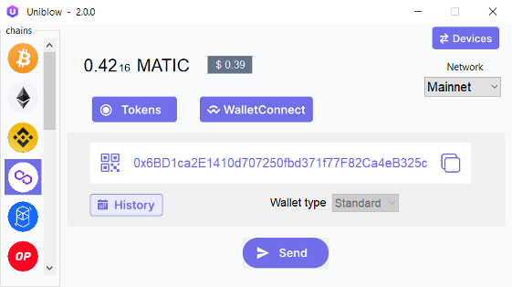

# Uniblow


A **uni**versal **blo**ckchain **w**allet for cryptos

* Handy, almost 1-click
* Fast and lightweight
* Don't wait for confirmation, instant transactions
* Multiple cryptos blockchains
* Multiple networks (testnets,...)
* Multi platforms : PC, Mac and Linux
* Open source GPLv3

The Uniblow software can also be used integrated in your services, as it provides a unified, platform agnostic and blockchain agnostic interface to manage many differents wallets. By using the wallet class, this is as simple as : `ETH_wallet = wallet("ETH", "mainnet", device)`, and you get the interface methods mentioned in the developer section below.



Don't expect to make complicated DeFi transactions, nor advanced settings for the fees. This software provides an easy and basic wallet, focused on universality and ease in use, as it works on multiple blockchains and platforms.

Compatible with the following blockchains :

* BTC
    * mainnet and testnet networks
    * Standard wallet
    * Segwit P2SH compatibility
    * Full Segwit bech32
* ETH
    * mainnet, Rinkeby, Ropsten, Kovan and Goerli networks
* LTC
    * mainnet and testnet networks
    * Standard wallet
    * Segwit P2SH compatibility
* DOGE
    * mainnet and testnet networks
* EOS
    * EOSIo and Jungle3 networks
* XTZ
    * tz2 wallet
    * Main Tezos and Edo testnet networks

## Devices

### BasicFile device

The BasicFile device encrypts your private key [with a random salt using libsodium XSalsa20/Poly1305](https://libsodium.gitbook.io/doc/secret-key_cryptography/secretbox#algorithm-details), with an encryption key derived from the user chosen password using [Argon2id (moderate settings)](https://raw.githubusercontent.com/P-H-C/phc-winner-argon2/master/argon2-specs.pdf). One can choose to use a default password. To do so, just left blank the password prompt input when asked the first time at device setting. Without your personal password, the security of the key is what your hard-drive computer offers for your files.  
If you setup a password but forget it, there would be no way to recover your coins.

Your key encrypted is stored in JSON and hex in the BasicFileWallet.key in the same folder as Uniblow. Hence the name "BasicFile" for this device.

### OpenPGP device

Works with an OpenPGP v3 device which accepts User Interaction confirmation (button).

This device type is very secure, because the signature is performed in the OpenPGP physical device, outside of the computer. Most of these devices are built with a secure element chip. The private key never escapes the hardware device boundary. Note that the drawback is that there is no easy backup of the keys, so one have to take care of not forgetting the PIN or losing the device. Some blocchain based hardware wallet offering the OpenPGP mechanism offers some link with the seed, as the Ledger Nano S/X , [see details there](https://github.com/LedgerHQ/openpgp-card-app/blob/master/doc/user/blue-app-openpgp-card.rst).

For the best experience, the OpenPGP device should be in its default reset state before using it with uniblow. Uniblow asks the user to choose the admin PIN (PIN3), and the user PIN (PIN1), then it configures the device with these PINs.  
The device can also be already configured, and has one EC256k1 key generated in the SIG key slot. Uniblow will eventually ask for the user PIN1 and use this key.

Without backup, if you forget the PIN, or lost the OpenPGP device, there would be no way to recover your coins.

The Yubico 5 is a recommended OpenPGP device.

## Use the GUI

* Download the Uniblow binary [in Github releases](https://github.com/bitlogik/uniblow/releases/latest)

To increase the security, the Windows exe releases are [signed with our Extended Validation certificate](https://en.wikipedia.org/wiki/Code_signing#Extended_validation_(EV)_code_signing), bringing even greater confidence in the integrity of the application.

## Development

### ToDo list

features in development :

* Verify checksum when checking address
* HD wallet device (BIP32/39/44)
* ERC20 tokens on ETH

### Use it from source

* For the GUI, [install wxPython 4](https://wxpython.org/pages/downloads/) with your system binaries wheels.
    * Windows and MacOS: Use `pip3 install -U wxPython`
    * Linux : use your package manager, as `apt-get install python3-wxgtk4.0`
* Install this package and its dependencies
    * `python3 -m pip install .`
* For ETH, put your Infura key in ETHwallet, or use the EtherscanAPI

### Add more cryptos

For developers, one can easily add any crypto in this wallet, following this Python3 programming interface class :

```Python
class newCOINwallet:
    def __init__(self, coin, *options):
     ... create the wallet, for now options is network,wtype indexes (indexing the list returned by get_networks and get_account_types)

    def get_networks(self):
     ... return list of different possible networks names

    def get_account_types(self):
     ... return list of different possible account types

    def get_account(self):
     ... return the account name (address or similar)

    def get_balance(self):
     ...

    def check_address(self, addr_str):
     ... return True if the address/account name is valid
    
    def history(self):
     ... return a tx list for this account (not used for now)

    def transfer(self, amount, to_account, fee):
     ... transfer to pay x coin unit to an external account and return txid
     ... fee is 0, 1 or 2 : "economic", "normal", "fast"
    
    def transfer_all(self, to_account, fee_priority):
     ... transfer all the wallet to an address (minus fee)
     ... fee is 0, 1 or 2 : "economic", "normal", "fast"
```